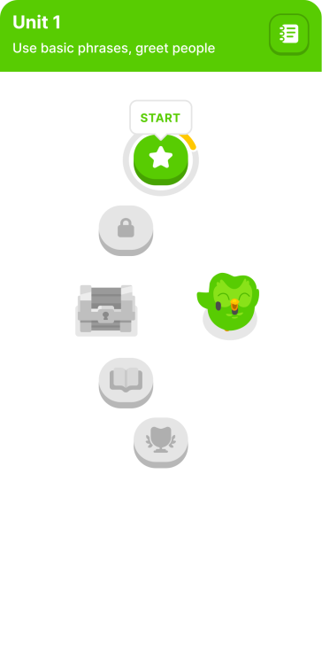
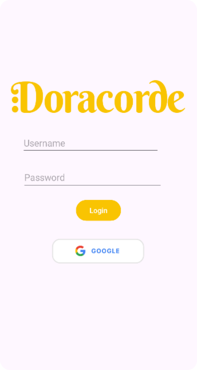
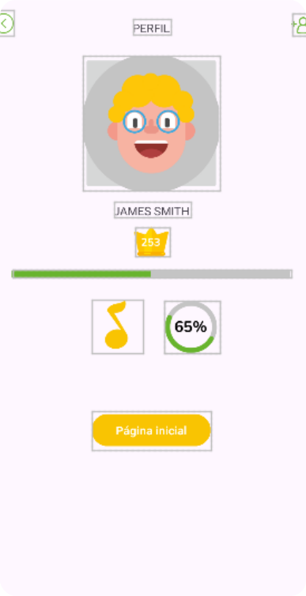
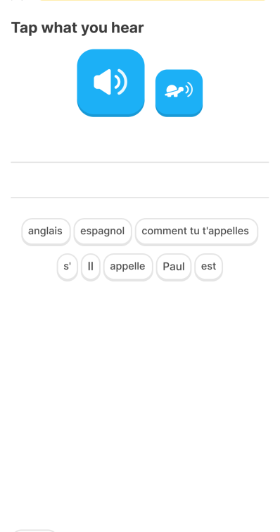

## Integrantes do Grupo
- **Ana Carolina Tavares** - RM552283
- **Giovanni Paschoalatto** - RM98837
- **Sofia Sprocatti** - RM99208
- **Vinicius Minei** - RM98486
- **Gabriel Lopes Pereira** - RM98023

# Duocorde: Plataforma de Educação Musical Inclusiva

**Duocorde** é uma plataforma inovadora de educação musical inspirada no método de aprendizado progressivo do Duolingo, adaptada para atender às necessidades de pessoas com deficiência visual. Nosso objetivo é criar um ambiente de aprendizagem inclusivo, acessível e eficaz, proporcionando uma experiência musical enriquecedora para todos.

## Objetivo do Projeto

O objetivo do projeto é desenvolver uma plataforma inclusiva que permita o aprendizado musical de forma intuitiva e interativa para pessoas com diferentes níveis de habilidade visual. A plataforma adota uma abordagem centrada no usuário e está adaptada para interfaces assistivas, garantindo uma experiência educativa completa e significativa para qualquer pessoa.

## Funcionalidades Principais

- **Aprendizado progressivo**: conteúdo adaptado para diferentes níveis de habilidade musical.
- **Acessibilidade**: integração com tecnologias assistivas para usuários com deficiência visual.
- **Interface amigável**: design simplificado e intuitivo, com feedback sonoro e textual.
- **Sistema de progresso**: monitoramento das conquistas e progresso do usuário, inspirado no método da Duolingo.

## Firebase Integration

O Firebase é utilizado no projeto para facilitar a autenticação e o armazenamento de dados em tempo real. As principais integrações com o Firebase incluem:

- **Autenticação**: Permite que os usuários façam login de maneira segura na plataforma, utilizando Firebase Authentication.
- **Banco de Dados em Tempo Real**: Utilizamos o Firebase Realtime Database para armazenar e sincronizar dados do usuário, como progresso de aprendizado e conquistas.
- **Notificações**: Firebase Cloud Messaging é empregado para enviar notificações de lembretes e atualizações importantes aos usuários.
- **Armazenamento**: O Firebase Storage é utilizado para guardar materiais educacionais, como arquivos de áudio e partituras, acessíveis para os usuários durante o aprendizado.

## Link do GitHub
[GitHub - Duocorde](https://github.com/anabrandt/duocorde)

## Demonstração Visual

<div style="display:flex;">
  
  
  
  
</div>

## Como Executar o Projeto

1. Clone o repositório:
   ```bash
   git clone https://github.com/anabrandt/duocorde.git
